# Job Intelligence Platform

A local-first job-search intelligence system for UK graduate software roles. It discovers jobs from employer ATS feeds, graduate boards and aggregators; merges duplicates across sources; ranks each job against an evidence-backed candidate profile with a per-component explanation; and produces job-specific one-page CVs that are grounded in cited evidence and gated by human review.

It is a personal tool that I use for my own job search, published as a software-engineering portfolio project. It is **not** a hosted product. Personal runtime data (candidate profile, CVs, applications, scraped snapshots) lives in a git-ignored local store and is not in this repository.

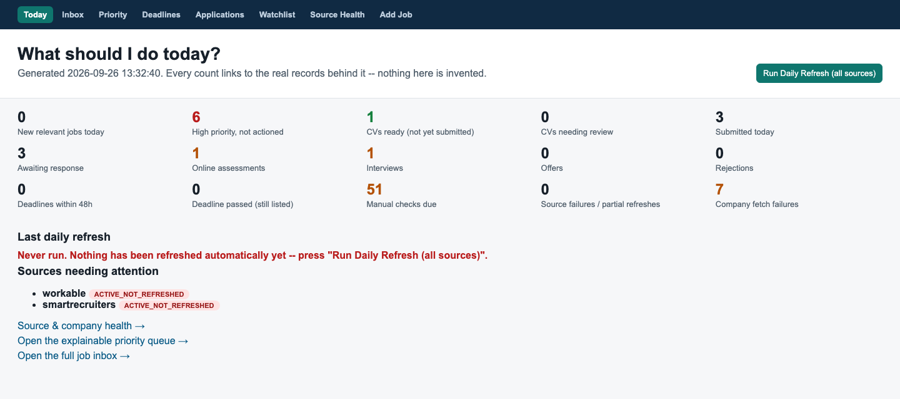
<sub>The **Today** page: every count links to the underlying records. All screenshots in this README use synthetic fixture data and a fictional candidate.</sub>

---

## Contents

- [Why this exists](#why-this-exists)
- [Workflow at a glance](#workflow-at-a-glance)
- [Architecture](#architecture)
- [Source coverage model](#source-coverage-model)
- [Deduplication, history and closure](#deduplication-history-and-closure)
- [Evidence-grounded candidate model](#evidence-grounded-candidate-model)
- [Matching and ranking](#matching-and-ranking)
- [CV generation workflow](#cv-generation-workflow)
- [Application lifecycle](#application-lifecycle)
- [Optional Gemini advisory layer](#optional-gemini-advisory-layer)
- [Dashboard](#dashboard)
- [Repository structure](#repository-structure)
- [Quick start](#quick-start)
- [Testing](#testing)
- [Privacy and local data](#privacy-and-local-data)
- [Known limitations](#known-limitations)
- [Status](#status)

---

## Why this exists

UK graduate hiring is spread across hundreds of employer ATS boards (Greenhouse, Lever, Ashby, Workday and others), aggregators, and graduate boards, several of which have no public API. The same vacancy often appears in three places with slightly different text, and the deadline, sponsorship and graduation-year details that decide eligibility are buried in free-text job descriptions.

The project treats this as an integration and data-quality problem, not a keyword search:

- pull from compliant, documented public endpoints and record honestly what could **not** be checked automatically;
- merge what is really the same vacancy, but never hide two real postings behind a heuristic;
- never infer that a job has closed unless the source's full listing was actually observed;
- score jobs against evidence of what the candidate has actually built, with every score explained;
- tailor CVs by *selecting and narrowing* real evidence, never by inventing it, and keep a human in the loop for every application.

## Workflow at a glance

```text
daily-refresh ─► registry ATS boards + Adzuna + Prospects ─► normalise ─► enrich ─► dedup ─► history/closure
                                                                                                │
manual imports (Trackr, Gradcracker, Bright Network, any URL) ──────────────────────────────────┤
                                                                                                ▼
                        explainable ranking ◄── Evidence Bank (CV, projects, GitHub READMEs)
                                │
                                ▼
       Today / Priority queue ─► CV workbench ─► human review ─► submit manually ─► application tracker
```

A typical day: run **Daily Refresh** (dashboard button or `daily-refresh`), open **Today** to see new relevant jobs, failed sources and manual checks due, work the **Priority** queue, generate a tailored CV for a strong match, review it, apply on the employer's own site, then record the submission. The CV version is then frozen against that application.

## Architecture

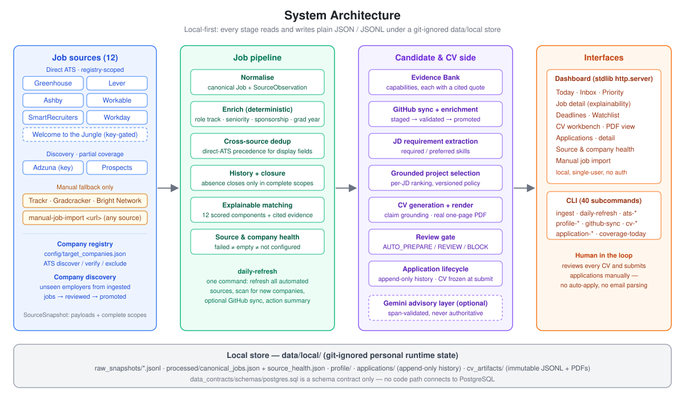

- **Connectors** share one `JobSourceConnector` interface and return a `SourceSnapshot`: the payloads plus the scopes (board, site, tenant) whose *entire* listing was observed. That completeness signal is what makes safe closure inference possible.
- **Pipeline** stages are deterministic and plain Python: normalisation to a canonical `Job`/`SourceObservation` model, enrichment (role track, seniority, sponsorship, graduation year), layered deduplication, history tracking and scoring.
- **Candidate side**: an Evidence Bank of cited capabilities, JD requirement extraction, per-JD project selection, CV composition, claim grounding, real PDF rendering, the review gate and application tracking.
- **Interfaces**: a 40-subcommand CLI and a local dashboard built on the standard library's `http.server`. Both read the same store.
- **Storage** is plain JSON/JSONL under `data/local/`. `data_contracts/schemas/postgres.sql` is a schema contract for a possible future persistence layer; **no code path connects to PostgreSQL today**.

Runtime dependencies are deliberately small: `reportlab` (real PDF layout and page counting) and `PyYAML` (loading the versioned CV-tailoring policy). Connectors use `urllib`, the dashboard uses `http.server`, and deduplication uses `difflib`.

### Daily refresh and data flow

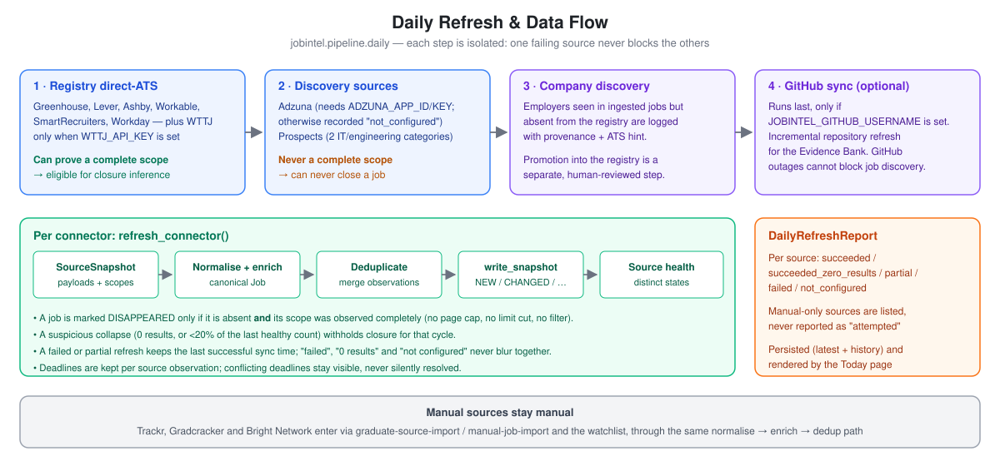

`daily-refresh` runs the automated sources in isolation, so one failing board never stops the others. It then logs employers that aren't in the registry yet and, optionally, syncs GitHub evidence. It persists a report that keeps five outcomes separate: *succeeded*, *succeeded with zero results*, *partial*, *failed* and *not configured*. A broken source is never shown as "0 new jobs".

## Source coverage model

Coverage metadata is generated from code (`src/jobintel/source_coverage.py`, `company_coverage.py`), not hand-maintained prose. `coverage-today` and the **Source Health** page read it together with live health data.

| Source | Access | Status in code | Notes |
|---|---|---|---|
| Greenhouse, Lever, Ashby, Workable, SmartRecruiters | Public job-board APIs | `PRODUCTION_READY` for registry-configured boards | Only companies already in the registry. This is not "every company on that ATS". |
| Workday | Public CXS careers-site endpoint | `PRODUCTION_READY` for configured tenants | Generic connector; 3 tenants enabled in the published registry. |
| Welcome to the Jungle | Official WelcomeKit Jobs API | Implemented, **key-gated** | Needs `WTTJ_API_KEY` and per-company organisation references. The published registry configures none, so in practice WTTJ is used through `wttj-import` / `manual-job-import`. |
| Adzuna | Official search API | `PARTIAL_COVERAGE` | Needs `ADZUNA_APP_ID`/`ADZUNA_APP_KEY` (reported as *not configured* otherwise). Paginates up to ~1000 results per refresh. Descriptions are often snippets, links may point at Adzuna rather than the employer, and deadlines are usually absent. **Never used for closure.** |
| Prospects | schema.org `JobPosting` data | `PARTIAL_COVERAGE` | Two sector categories (IT, engineering). It gives real deadlines, but it isn't a complete scope, so it can never close a job. |
| Trackr, Gradcracker, Bright Network | none viable | `MANUAL_FALLBACK_ONLY` | Cloudflare-protected or rate-limited to the point of being unusable. Imported by hand through the same pipeline and tracked on a manual **Watchlist**. |

**Company registry.** `config/target_companies.json` holds 83 target employers. `company-coverage-report` classifies them into five states; the published config currently reports **37 AUTO_VERIFIED, 39 MANUAL_REQUIRED, 7 TEMPORARILY_FAILED** (44.6% automatic coverage *of this registry*, not of the UK graduate market). `ats-discover` / `ats-verify` probe the careers URLs of registry companies, and `ats-exclude` makes a manual exclusion persist.

**Company discovery.** `company-discovery-scan` finds employers that appear in ingested jobs but aren't in the registry. It records provenance and an ATS hint when the application URL reveals one. Promotion into the registry is an explicit, reviewed step (`company-discovery-promote`).

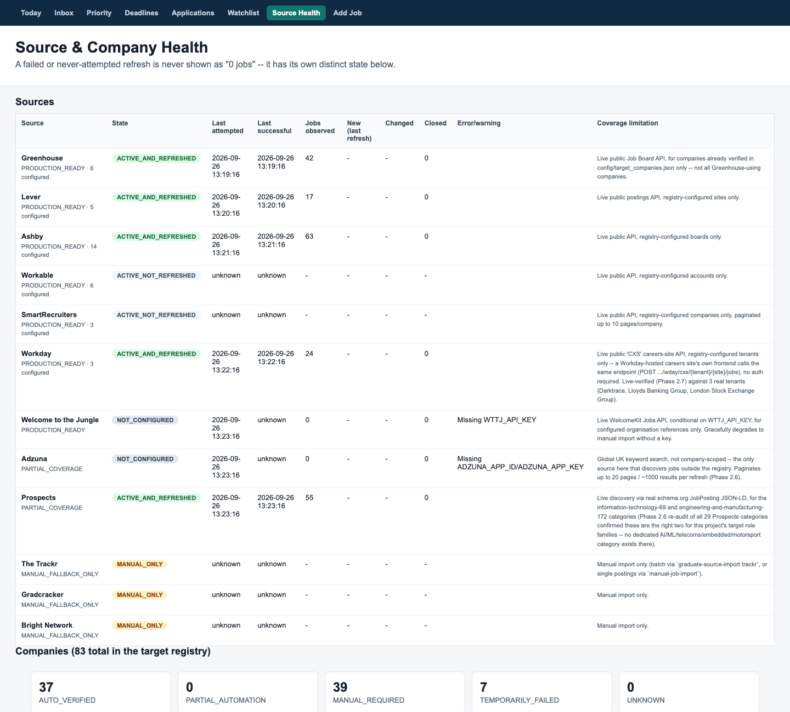
<sub>**Source Health**: each source's state, last attempt vs. last success, closures and its coverage limitation, followed by the five-state company breakdown.</sub>

## Deduplication, history and closure

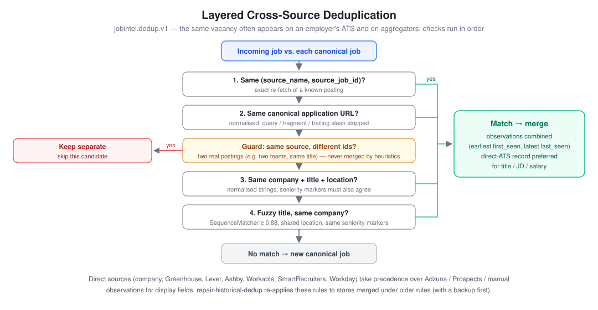

- **Layered matching** (`dedup/v1.py`) checks, in order: same source ID, then same canonical application URL, then same company + title + location, then a fuzzy title match (`SequenceMatcher` ≥ 0.88). The last two also require matching seniority markers. A guard keeps two different IDs from the *same* source apart, because they are real separate postings.
- **Source precedence:** when observations merge, a direct employer/ATS record (company, Greenhouse, Lever, Ashby, Workable, SmartRecruiters, Workday) supplies the title, JD and salary ahead of aggregator or manual copies. Every observation is still kept for provenance.
- **History:** each observation carries `first_seen_at` / `last_seen_at` and a state (`NEW`, `CHANGED`, `UNCHANGED`, `DISAPPEARED`, `REAPPEARED`). Jobs are never deleted, and deadlines are stored per observation so conflicting deadlines stay visible.
- **Closure invariant:** a job can be marked `DISAPPEARED` only if it is absent from a scope the connector *proved* it observed completely. Page caps, per-identifier limits, keyword filters, partial failures and suspicious collapses (0 results, or <20% of the last healthy count) all withhold closure. Adzuna, Prospects and manual imports can never close anything.
- `repair-historical-dedup` re-applies the current rules to stores merged under older ones and takes a backup first.

## Evidence-grounded candidate model

The candidate profile is an **Evidence Bank**. Each capability (e.g. *PostgreSQL*) carries the exact quote it was extracted from, the source (CV text, project description, README, education), the project it belongs to, a confidence value, and a derived tier: *strong*, *partial* or *missing*.

- `profile-import` / `profile-rebuild` extract capabilities from local files. `profile-set-contact` stores contact details, which are never inferred or fabricated.
- `github-sync` incrementally discovers the account's public repositories, with no hard-coded list. It feeds READMEs and GitHub's language breakdown into the same extraction path.
- **Curated evidence.** A local enrichment step adds hand-curated, atomic evidence items through a *stage → diff → validate → promote* flow, and its validator rejects known over-claims ("forbidden extrapolations"). That content describes my own projects, so the tool and its data are kept out of this repository. What is published is the store-side contract: once a curated bank is promoted, `profile-rebuild` refuses to overwrite it with raw keyword hits (`tests/test_profile_rebuild_promoted.py`).
- The **graduation year** of the candidate is kept separate from a job's **intake year**. A 2027-intake graduate scheme can still be open to a 2026 graduate, and the matcher and review gate treat the two differently.

## Matching and ranking

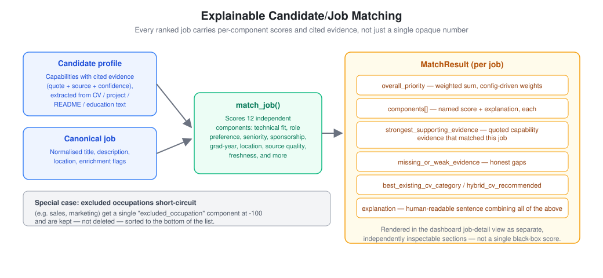

`matching.matcher.match_job` returns 12 named components instead of one opaque score: technical match, role function, role preference, engineering domain, market fit, seniority, required experience, sponsorship, graduation year, location, source quality and freshness. Each result carries the cited candidate evidence that matched, the gaps, and an assembled explanation. Excluded occupations (e.g. sales) short-circuit to a single component and are kept at the bottom of the list, not deleted. Weights live in `config/personal_strategy.json`.

Role tracks (backend, data, cloud, platform, AI/ML, network software, telecoms, embedded, IoT and others) are inferred deterministically from title and JD phrases, with cross-track signals recorded.

<table>
<tr>
<td width="50%">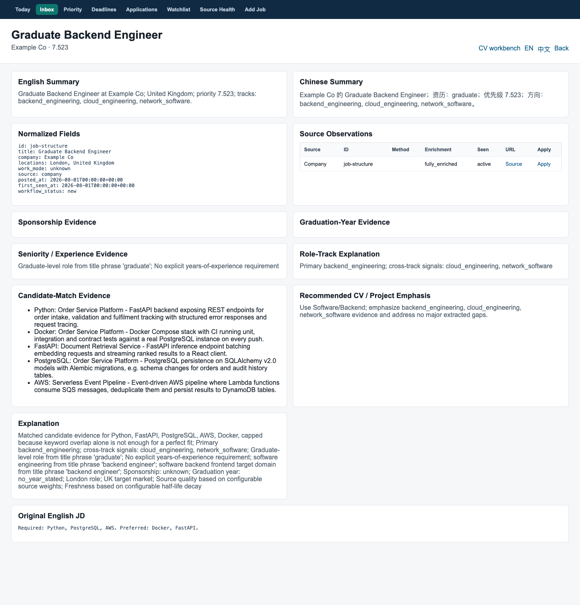</td>
<td width="50%">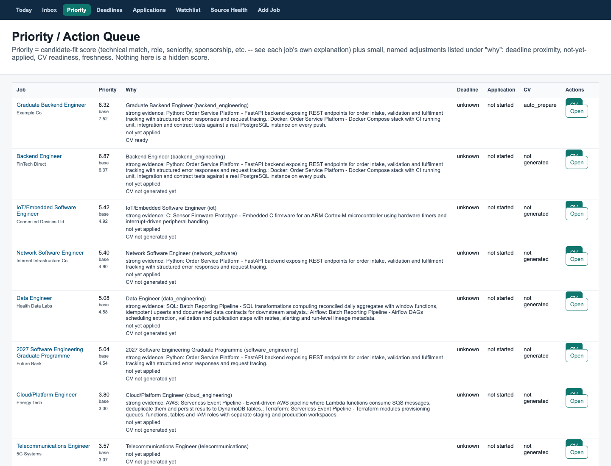</td>
</tr>
<tr>
<td><sub><b>Job detail</b>: normalised fields, source observations, sponsorship / graduation-year / seniority evidence, the role-track explanation and the matched candidate evidence.</sub></td>
<td><sub><b>Priority queue</b>: candidate-fit score plus small, named adjustments (deadline, not yet applied, CV readiness). The "why" is shown per row.</sub></td>
</tr>
</table>

## CV generation workflow

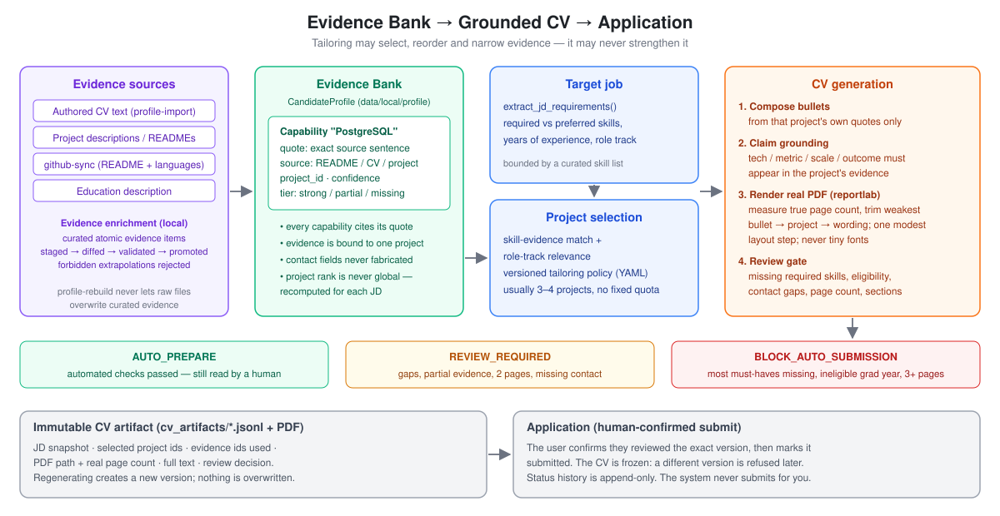

`cv-generate` (or **Regenerate CV** in the dashboard) runs this pipeline:

1. **JD requirement extraction** (`analysis/jd_requirements.py`): required vs. preferred skills, years of experience and role track.
2. **Grounded project selection** (`matching/project_selection.py`, `policy_selector.py`): projects are ranked *per job* by skill-evidence match and role-track relevance, under a versioned tailoring policy (`data/policies/cv_tailoring_skill_v1.yaml`). Usually 3–4 projects are chosen, with no fixed quota and no global "best projects" order.
3. **Bullet composition** from that project's own evidence quotes only; evidence is never borrowed across projects.
4. **Claim grounding** (`matching/claim_grounding.py`): every technology, metric, scale or outcome in a bullet must appear in that project's evidence.
5. **Real one-page layout** (`matching/cv_render.py`, `reportlab`): the PDF is actually rendered and its true page count measured. On overflow the generator trims the weakest bullet, then the weakest project, then tightens wording, and allows one modest layout step. It never shrinks to tiny fonts. Page utilisation is also checked, so a half-empty page is flagged.
6. **Review gate** (`matching/review_gate.py`): `AUTO_PREPARE`, `REVIEW_REQUIRED` or `BLOCK_AUTO_SUBMISSION`, with reasons such as missing required skills, partial-only evidence, an explicit graduation-year mismatch, no sponsorship, missing contact details, page count, or missing sections.
7. **Immutable artifact** (`storage/cv_artifact_store.py`): an append-only JSONL record that holds the JD snapshot, the selected project and evidence IDs, the PDF path, the real page count, the full text and the review decision. Regenerating creates a new version.

`AUTO_PREPARE` means the automated checks passed. It does **not** mean the CV is safe to send unread. The dashboard says so on every CV, and submitting requires an explicit "I have reviewed this exact version" confirmation. A regression suite (`tests/test_cv_tailoring_harness.py`) pins the policy's decisions on 28 historical tailoring cases.

<table>
<tr>
<td width="55%">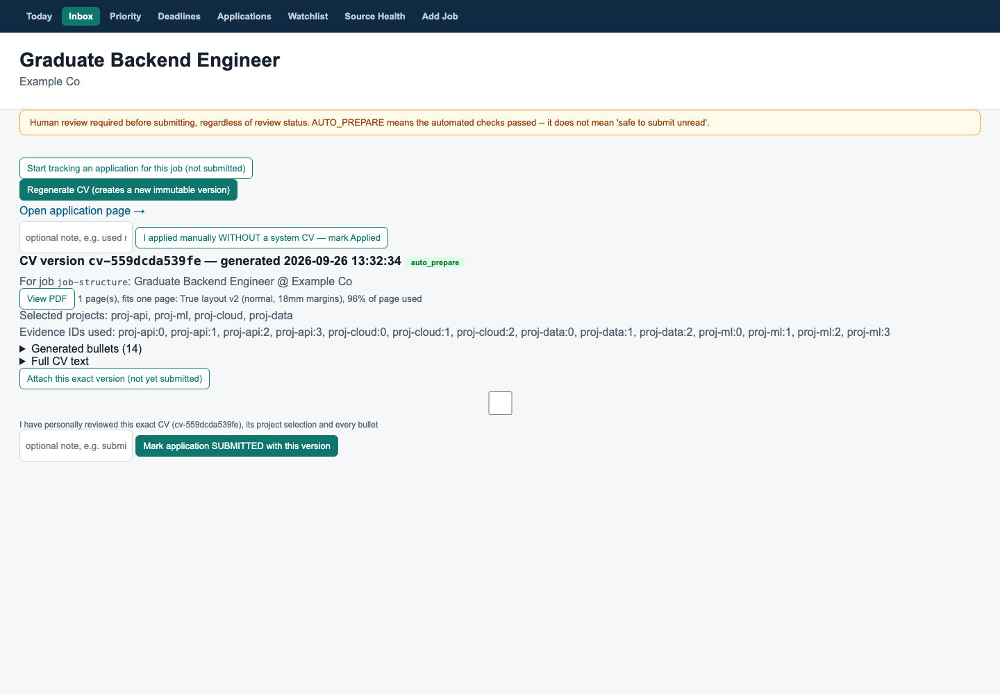</td>
<td width="45%">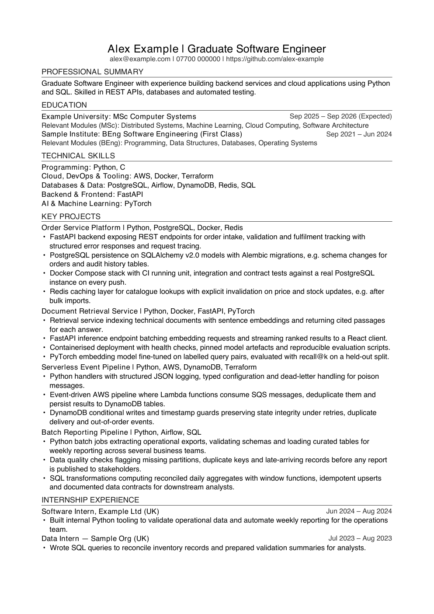</td>
</tr>
<tr>
<td><sub><b>CV workbench</b>: version, review status, real page count and utilisation, selected projects and the exact evidence IDs used.</sub></td>
<td><sub><b>Rendered output</b> for the fictional test candidate "Alex Example": every project bullet traces to a cited evidence quote.</sub></td>
</tr>
</table>

## Application lifecycle

```text
discovered → shortlisted → materials_ready → applied → online_assessment
           → phone_screen → technical_interview → final_interview → offer
terminal: rejected · withdrawn · expired
```

- Ownership is split by phase: pre-application triage (`new`, `saved`, `ignore`) lives with the job, and everything from submission onward lives in `ApplicationStore`. There is one read projection, so the Inbox, Priority and Today pages can't disagree.
- Status history is **append-only** JSONL. A submitted application can't regress to a pre-submission state, and each job has at most one application (get-or-create, idempotent).
- At creation, an application snapshots the JD, the application URL, source provenance and the deadline. The CV is **frozen at submission**, and attaching a different version afterwards is refused. You can also record "applied manually without a system CV" honestly, without a CV being linked after the fact.
- Status changes are entered by the user. There is no email parsing and no automatic status detection.

<table>
<tr>
<td width="50%">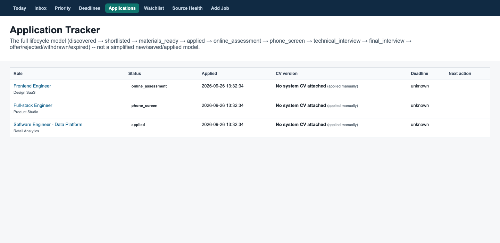</td>
<td width="50%">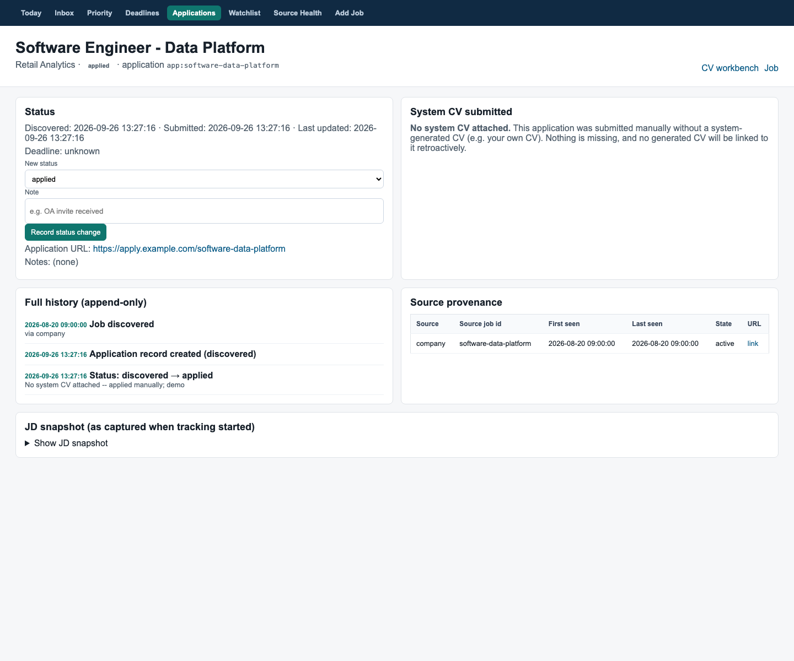</td>
</tr>
<tr>
<td><sub><b>Application tracker</b>: lifecycle status, submission time, the CV version used and the deadline.</sub></td>
<td><sub><b>Application detail</b>: append-only history, submitted-CV record, source provenance and the JD snapshot.</sub></td>
</tr>
</table>

## Optional Gemini advisory layer

`src/jobintel/intelligence/` is an **optional, non-authoritative** layer. It runs only when `GEMINI_API_KEY` is present in the environment; the key is never read from files or config. It does two-stage JD interpretation with exact-span validation against the JD text, proposes evidence relations from an audited catalogue, and prints a comparison against the deterministic baseline (`python -m jobintel.intelligence --job-id …`). Results go to a content-addressed cache.

- Without a key it makes no network request and returns the deterministic result.
- Nothing in ranking, eligibility, project selection or the dashboard/CLI CV paths depends on it. The CV generator has a hook that accepts model-proposed bullet rewrites, but only if each one passes the same claim-grounding validator. The default CV commands don't enable that hook.

See [docs/GEMINI_INTELLIGENCE.md](docs/GEMINI_INTELLIGENCE.md).

## Dashboard

`PYTHONPATH=src python3 -m jobintel.cli.main dashboard` serves a local, single-user, bilingual (English/Chinese) UI at `http://127.0.0.1:8765`:

| Page | Route | Purpose |
|---|---|---|
| Today | `/today` | What needs doing now: new relevant jobs, CVs to review, deadlines, failed sources, manual checks due |
| Inbox | `/inbox` | Filterable ranked shortlist with saved searches and refresh summary |
| Job detail | `/job?id=…` | Full explainability for one job |
| Priority | `/priority` | Action queue with the reason for each position |
| Deadlines | `/deadlines` | Jobs bucketed by deadline proximity |
| CV workbench | `/cv?job_id=…` | Generate, inspect, attach and submit CV versions; `/cv/pdf` serves the exact PDF |
| Applications | `/applications`, `/application?id=…` | Lifecycle list and detail |
| Watchlist | `/watchlist` | Manual-only sources and companies, each with a check cadence |
| Add Job | `/manual-import` | Import one job by URL through the canonical pipeline |
| Source Health | `/health` | Per-source and per-company coverage state |

POST actions cover daily refresh, saved searches, workflow status, CV generate/attach, application create/status/submit, watchlist check/snooze, and manual import. The server has no authentication and is meant for `127.0.0.1` only.

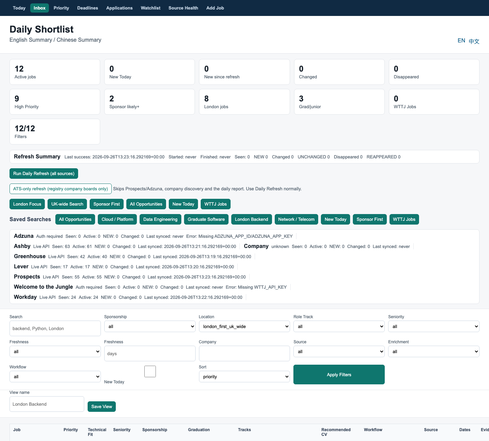
<sub><b>Inbox</b>: metrics, refresh summary, per-source status line, presets, saved searches and filters.</sub>

## Repository structure

```text
src/jobintel/
  connectors/        Greenhouse, Lever, Ashby, Workable, SmartRecruiters, Workday, WTTJ,
                     Adzuna, Prospects + manual_source / graduate_sources (manual import)
  pipeline/          ingestion, refresh (snapshot + health), daily (one-command orchestration)
  dedup/             v1 layered dedup, repair (historical re-dedup with backup)
  analysis/          role tracks, enrichment, job quality, jd_requirements
  matching/          matcher, project_selection, policy_selector, tailoring_skill,
                     claim_grounding, cv_generation, cv_document, cv_render, review_gate
  intelligence/      optional Gemini provider, grounding, service (advisory only)
  storage/           local JSON/JSONL stores: jobs, applications, CV artifacts,
                     repositories, company discovery, watchlist
  dashboard/         server (stdlib http.server), pages, service, operations, i18n
  models/            job, candidate, application, cv_artifact, taxonomy dataclasses
  cli/main.py        40-subcommand CLI
  profile_ingestion.py · evidence_enrichment.py · github_sync.py
  company_registry.py · ats_discovery.py · company_discovery.py
  company_coverage.py · source_coverage.py · application_lifecycle.py · history.py
config/              ranking strategy + 83-company target registry
data/policies/       versioned CV tailoring policy (YAML)
data_contracts/      PostgreSQL schema contract (not wired up)
docs/                design notes per subsystem (see below)
tests/               pytest suite + synthetic fixtures
```

## Quick start

Requires Python ≥ 3.12.

```bash
python3 -m pip install -e ".[dev]"

# Ranked list from built-in synthetic fixtures (no network, no credentials)
PYTHONPATH=src python3 -m jobintel.cli.main list-ranked --fixtures

# Pull live jobs from public boards / Prospects into a scratch store
PYTHONPATH=src python3 -m jobintel.cli.main ingest --greenhouse-board <board> --prospects --store /tmp/jobintel-demo --limit 50

# One daily command over the registry (Adzuna / WTTJ report "not configured" without keys)
PYTHONPATH=src python3 -m jobintel.cli.main daily-refresh --store /tmp/jobintel-demo

# What was checked automatically today, and what still needs a manual look
PYTHONPATH=src python3 -m jobintel.cli.main coverage-today --store /tmp/jobintel-demo

# Dashboard
PYTHONPATH=src python3 -m jobintel.cli.main dashboard --store /tmp/jobintel-demo
```

Building your own Evidence Bank and generating a CV:

```bash
PYTHONPATH=src python3 -m jobintel.cli.main profile-import ./my-project.md --source-type manual_project_description --title "My Project"
PYTHONPATH=src python3 -m jobintel.cli.main github-sync --username <your-github-username>
PYTHONPATH=src python3 -m jobintel.cli.main profile-set-contact --email you@example.com --phone "07700 900000"
PYTHONPATH=src python3 -m jobintel.cli.main profile-rebuild --name "Your Name" --graduation-year 2026
PYTHONPATH=src python3 -m jobintel.cli.main cv-generate --job-id <job-id> --print-cv
```

Optional environment variables: `ADZUNA_APP_ID` / `ADZUNA_APP_KEY`, `WTTJ_API_KEY`, `GITHUB_TOKEN`, `JOBINTEL_GITHUB_USERNAME`, `GEMINI_API_KEY`. Keep them in your shell or secret manager. `.env` files are git-ignored and never loaded automatically.

Run `PYTHONPATH=src python3 -m jobintel.cli.main --help` for all 40 subcommands.

## Testing

```bash
python3 -m pip install -e ".[dev]"      # pytest + pypdf (tests read rendered CV PDFs back)
PYTHONPATH=src python3 -m pytest tests/ -q
```

The published suite has **629 tests** across 50 test files. In a fresh clone (and in CI, `.github/workflows/tests.yml`, on Python 3.12 and 3.13) the result is **613 passed, 16 skipped**:

- 15 skips are tailoring-policy integration tests. They need the private local Evidence Bank, or the private notes the policy is hashed against, so without those files they skip rather than fail.
- 1 skip is an opt-in live-network source test.

On the development machine, where the private data and the local-only evidence-enrichment tests are present, the full local suite gives **645 passed, 1 skipped**.

Coverage includes connector normalisation and pagination, Adzuna health and live-regression fixtures, Workday and Prospects parsing, snapshot/closure invariants, layered and cross-source dedup (including manual vs. automated), source precedence, graduation-year vs. intake-year handling, source and company coverage, company discovery, GitHub sync, promoted-profile rebuild protection, JD requirement extraction, project selection, claim grounding, CV structure / page budget / persistence, the review gate, application lifecycle invariants, dashboard pages and routes, and the optional intelligence layer (with a mocked provider).

## Privacy and local data

- `data/local/` (candidate profile, contact details, CV artifacts and PDFs, applications, raw snapshots, caches) and `data/backups/` are **git-ignored**. This repository contains no real candidate profile, CVs, contact details or application records.
- The raw notes behind the tailoring policy and its regression fixture describe real past applications, so they stay local (`data/policies/sources/`, `tests/fixtures/sources/`). Only the derived YAML policy and test cases are published.
- The curated Evidence Bank content for my own projects, and the enrichment tool that holds it, are local-only for the same reason.
- Screenshots use `jobintel.fixtures.sample_data` and a fictional test candidate ("Alex Example", `example.com` addresses, a placeholder phone number).
- Credentials are only read from environment variables. Adzuna credential parameters are stripped from stored redirect URLs, and the Gemini key is sent in a request header.

## Known limitations

- **No complete market coverage.** ATS connectors cover only employers in the registry (37 of 83 auto-verified). Prospects covers two categories. Nothing here claims to see the whole UK graduate market.
- **Manual sources stay manual.** Trackr, Gradcracker and Bright Network have no automated path; they depend on the user importing listings.
- **Adzuna** needs credentials, returns snippet descriptions, may link to Adzuna rather than the employer, rarely exposes deadlines, and is never used to close jobs.
- **Welcome to the Jungle** automation needs an API key and organisation references that the published registry doesn't configure, so it is effectively manual import today.
- **No email-driven status updates, no auto-submit, no form filling.** The user submits every application and records status changes.
- **Generated CVs require human review.** Grounding and the claim validator lower the risk of overstated or invented content, but they can't make it impossible. JD skill recognition is also bounded by a curated keyword list.
- The **dashboard** is single-user and unauthenticated, intended only for `127.0.0.1`.
- **PostgreSQL** is a schema contract only; all persistence is local JSON/JSONL.
- The optional Gemini layer is advisory and has had limited live validation (see its doc).

## Status

Actively used for my own UK graduate job search (2026 graduation) and developed alongside it. This is a serious personal system and engineering portfolio project, **not production software**: single user, local store, no deployment. Design notes for each subsystem are in `docs/`:

- [ARCHITECTURE](docs/ARCHITECTURE.md) · [SOURCES](docs/SOURCES.md) · [SOURCE_COVERAGE](docs/SOURCE_COVERAGE.md) · [GRADUATE_SOURCES](docs/GRADUATE_SOURCES.md) · [WTTJ_INTEGRATION](docs/WTTJ_INTEGRATION.md) · [COMPANY_REGISTRY](docs/COMPANY_REGISTRY.md)
- [JOB_MODEL](docs/JOB_MODEL.md) · [RANKING](docs/RANKING.md) · [CANDIDATE_MODEL](docs/CANDIDATE_MODEL.md) · [PROFILE_INGESTION](docs/PROFILE_INGESTION.md) · [GITHUB_SYNC](docs/GITHUB_SYNC.md)
- [CV_GENERATION](docs/CV_GENERATION.md) · [APPLICATION_TRACKER](docs/APPLICATION_TRACKER.md) · [GEMINI_INTELLIGENCE](docs/GEMINI_INTELLIGENCE.md)
- Phase reports: [PHASE3_WORKFLOW](docs/PHASE3_WORKFLOW.md) · [PHASE3_VALIDATION](docs/PHASE3_VALIDATION.md) · [LIVE_JOB_VALIDATION](docs/LIVE_JOB_VALIDATION.md) · [3.5B grounded CV](docs/PHASE_3_5B_GROUNDED_CV_REPORT.md) · [3.7 tailoring policy](docs/PHASE_3_7_CV_TAILORING_SKILL.md)
